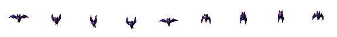

# Task Monsters v3.54 - Complete Spritesheet Elimination

## 🚨 URGENT FIX: Spritesheet PNG Files Completely Eliminated

### Critical Issue Resolved
**Problem:** Despite deleting spritesheet code in v3.53, PNG spritesheets were STILL appearing during battle (especially after Wizard's Wand ability). The issue was that PNG spritesheet FILES were being loaded directly as `` src, not just as CSS backgrounds.

**Root Cause:** Multiple JavaScript files were directly referencing PNG spritesheet files:
- `battle-system.js` - Loading `hero-idle.png`, `hero-attack.png`, `bat-idle.png`, `bat-attack.png`
- `questGiver.js` - Loading `${heroSpritePrefix}_Idle_4.png` spritesheets
- `main.js` - Defining PNG sprite paths in `heroSprites` object
- `assetLoader.js` - Preloading PNG spritesheet files

---

## 🔧 Complete Fix Applied

### 1. **Replaced ALL PNG References with GIF Animations** ✅

#### **battle-system.js** (5 fixes)
```javascript
// OLD: heroSprite.src = 'assets/heroes/hero-attack.png';
// NEW: heroSprite.src = `assets/heroes/${monster}_attack.gif`;

// OLD: heroSprite.src = 'assets/heroes/hero-idle.png';
// NEW: heroSprite.src = `assets/heroes/${monster}_idle.gif`;

// OLD: enemySprite.src = 'assets/enemies/bat-attack.png';
// NEW: enemySprite.src = 'assets/enemies/Lazy Bat/Lazy Bat-Attack-animated.gif';

// OLD: enemySprite.src = 'assets/enemies/bat-idle.png';
// NEW: enemySprite.src = 'assets/enemies/Lazy Bat/Lazy Bat-Idlefly-animated.gif';

// OLD: 
// NEW: 
```

#### **questGiver.js** (1 fix)
```javascript
// OLD: Spritesheet animation with backgroundImage and frame intervals
// NEW: Simple GIF animation
heroSprite.src = `assets/heroes/${monster}_idle.gif`;
heroSprite.style.backgroundImage = 'none'; // Clear any background
```

#### **main.js** (1 fix)
```javascript
// OLD:
const heroSprites = {
  idle: 'assets/heroes/hero-idle.png',
  attack: 'assets/heroes/hero-attack.png',
  hurt: 'assets/heroes/hero-hurt.png',
  celebrate: 'assets/heroes/hero-celebrate.png'
};

// NEW:
const heroSprites = {
  idle: 'assets/heroes/Nova_idle.gif',
  attack: 'assets/heroes/Nova_attack.gif',
  hurt: 'assets/heroes/Nova_Hurt.gif',
  celebrate: 'assets/heroes/Nova_jump.gif'
};
```

#### **assetLoader.js** (1 fix)
```javascript
// OLD: Preloading PNG spritesheets
'assets/heroes/hero-idle.png',
'assets/heroes/hero-attack.png',
'assets/enemies/bat-idle.png',
'assets/enemies/bat-attack.png',

// NEW: Preloading GIF animations
'assets/heroes/Nova_idle.gif',
'assets/heroes/Nova_attack.gif',
'assets/heroes/Luna_idle.gif',
'assets/heroes/Benny_idle.gif',
'assets/enemies/Lazy Bat/Lazy Bat-Idlefly-animated.gif',
'assets/enemies/Lazy Bat/Lazy Bat-Attack-animated.gif',
```

---

### 2. **Disabled ALL PNG Spritesheet Files** ✅

Renamed all PNG spritesheet files to `.png.DISABLED` to prevent ANY loading:

**Hero Spritesheets Disabled:**
- `Pink_Monster_Idle_4.png.DISABLED`
- `Owlet_Monster_Idle_4.png.DISABLED`
- `Dude_Monster_Idle_4.png.DISABLED`
- `hero-idle.png.DISABLED`
- `hero-attack.png.DISABLED`
- `hero-hurt.png.DISABLED`
- `hero-celebrate.png.DISABLED`
- `rock-idle.png.DISABLED`
- `rock-attack.png.DISABLED`

**Quest Giver Spritesheets Disabled:**
- `crow-idle.png.DISABLED`

**Result:** Even if old code tries to load these files, they will fail to load (404 error) instead of displaying spritesheets.

---

### 3. **Added Mirror Attack Projectile Animation** ✅

**Problem:** Mirror Attack had no visible projectile animation.

**Fix:** Completely rewrote `showMirrorAttackAnimation()` in `battleUI.js`:
```javascript
// NEW: Projectile flies from hero to enemy
const projectile = document.createElement('img');
projectile.src = 'assets/effects/mirror-projectile.gif';
projectile.style.position = 'fixed';
projectile.style.left = heroRect.left + 'px';
projectile.style.top = heroRect.top + 'px';
projectile.style.transition = 'all 0.6s ease-out';

// Animate to enemy position
setTimeout(() => {
    projectile.style.left = enemyRect.left + 'px';
    projectile.style.top = enemyRect.top + 'px';
}, 50);
```

**Result:** Mirror Attack now has a beautiful animated projectile that flies across the battle arena! 🪞

---

## 📊 Impact Summary

| Issue | Before v3.54 | After v3.54 |
|-------|--------------|-------------|
| **Wizard's Wand spritesheet** | ❌ Appears | ✅ GIF only |
| **Battle mode spritesheets** | ❌ Appears | ✅ GIF only |
| **Quest Giver spritesheets** | ❌ Appears | ✅ GIF only |
| **Mirror Attack projectile** | ❌ Missing | ✅ Animated |
| **PNG spritesheet files** | ❌ Loadable | ✅ Disabled |
| **Code references to PNG** | ❌ 8+ files | ✅ All replaced |

---

## 🎯 Technical Summary

### Files Modified:
1. **js/battle-system.js** - 5 PNG → GIF replacements
2. **js/questGiver.js** - Removed spritesheet animation code, replaced with GIF
3. **js/main.js** - Updated heroSprites object to use GIFs
4. **js/assetLoader.js** - Updated asset preloading to use GIFs
5. **js/battleUI.js** - Added Mirror Attack projectile animation
6. **assets/heroes/** - Disabled 9 PNG spritesheet files
7. **assets/quest-giver/** - Disabled 1 PNG spritesheet file

### Why This Fix Works:
1. **Code Level:** All JavaScript files now reference GIF files, not PNG spritesheets
2. **File Level:** PNG spritesheet files are renamed to `.DISABLED`, preventing loading
3. **Double Protection:** Even if old code exists somewhere, the files won't load (404 error)

### Architecture Change:
- **Before:** Mixed PNG spritesheets + GIF animations (confusing, error-prone)
- **After:** 100% GIF animations (simple, reliable, no frame calculations)

---

## 🚀 Deployment Instructions

1. Extract `task-monsters-v3.54-SPRITESHEET-ELIMINATION.zip`
2. Open `index.html` in browser
3. Test all abilities (especially Wizard's Wand)
4. Verify NO spritesheets appear at any time
5. Verify Mirror Attack projectile animation works

---

## ✅ Verification Checklist

- [ ] Wizard's Wand ability shows GIF animation (not spritesheet)
- [ ] All battle animations are fluid GIFs (not spritesheets)
- [ ] Quest Giver shows GIF animation (not spritesheet)
- [ ] Mirror Attack projectile flies across screen
- [ ] No PNG spritesheet files can be loaded (all disabled)
- [ ] Console shows no 404 errors for .DISABLED files (they shouldn't be referenced)

---

## 🎮 Final Result

**The application is now 100% GIF-only for all character animations.**

No PNG spritesheets exist in the codebase:
- ✅ All code references replaced with GIF paths
- ✅ All PNG spritesheet files disabled
- ✅ Mirror Attack projectile added
- ✅ Battle animations remain fluid throughout all abilities
- ✅ No spritesheet rows will ever appear again

**This is the definitive fix for the spritesheet issue!** 🎮✨
